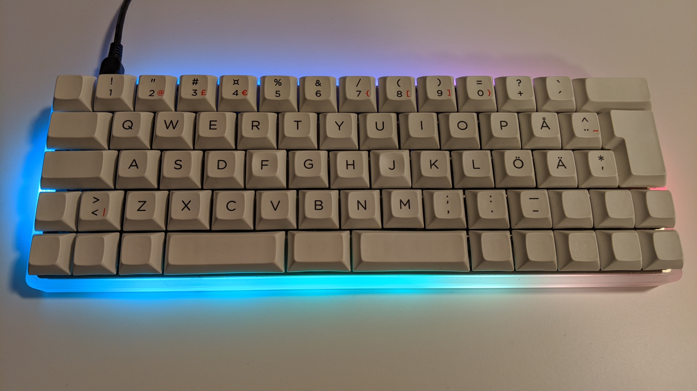
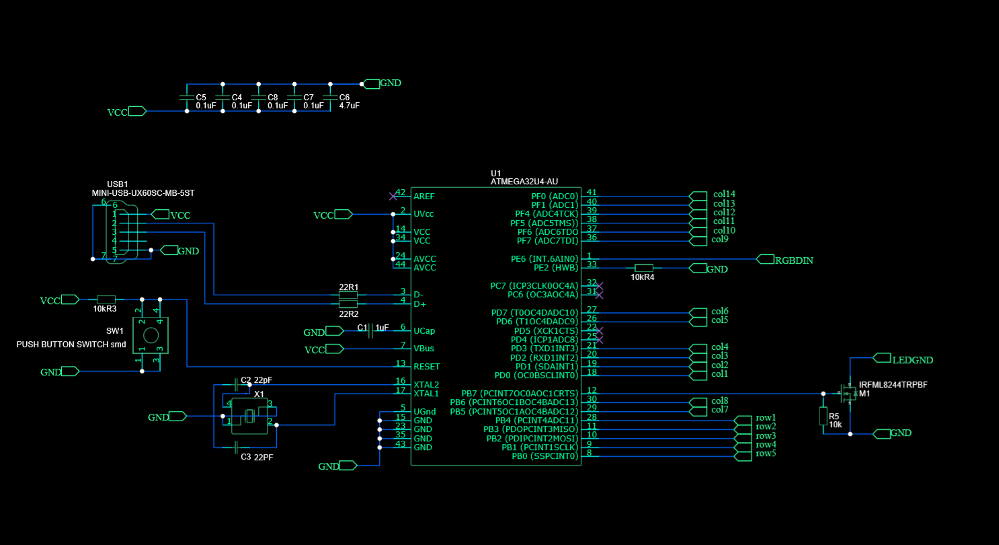
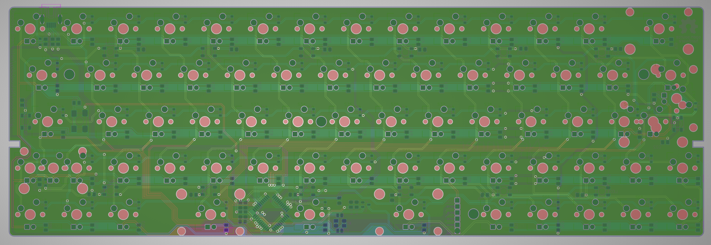

## >_Netrunner 60% Keyboard

Reprogramable 60% Keyboard featuring:
* Split spacebar layout
* Arrow key block
* ISO and ANSI compatible
* Backlit LED
* Addressable RGB backlight
* Compatible with any 60% case
* included CNC 60% case
* PCB mount capable

 

### Plate and Cace

The case and plate files are found in their /plate and /case folders respectively  
I highly recommend [laserboost](https://www.laserboost.com/keyboards) for the keyboard plate manufacturing 

### Firmware

The firmware file is found in /firmware/netrunnerkb.hex 

For reprogramming use the [Keyboard Firmware Builder](https://kbfirmware.com/) site for ease of use. **Please do consider Donating** :euro:  
You'll find the configuration file in /firmware/netrunnerkb.json 

You'll find the ISO and ANSI layout files in /firmware/KB_layout-raw-iso_0x1-Netrunner-keyboard_20190801001357.txt 
_**If you're going with the layout file please do look at the schematic pinout before proceeding**_ 

### Parts
 

Parts | Quantities
------------ | -------------
0805 330k Ω | 67
ATMEGA32U4-AU | 1
0805 100nF | 14
Cherry MX keycaps | 70
IRFML8244TRPBF | 1
WS2812B | 14
1N4148WS | 67
Switch button | 1
0805 4.7uF | 1
0805 0.1uF | 4
0805 1uF | 1
X1H016000FK1H-X 16MHz | 1
0805 22pF | 2
0805 22 Ω | 2
0805 10k Ω | 3
UX60SC-MB-5ST | 1

 Happy Hacking! 💻
